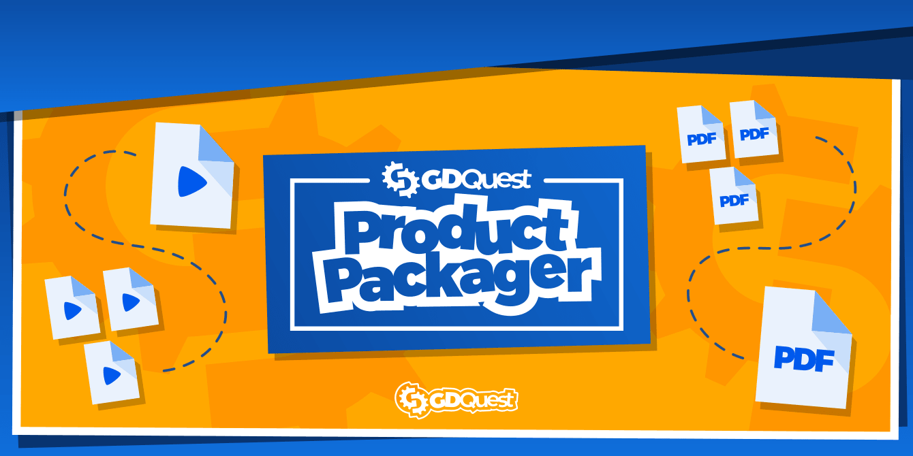

# GDQuest Product Packager



Product Packager is a tool to help creators package and publish their tutorial series, courses, tools, and other products to platforms like [Gumroad](https://gumroad.com/), [Itch.io](https://itch.io/), or [Mavenseed](https://mavenseed.com/).

It is currently **early in development** and **not suitable for production use**.

To get notified when the first stable release is out, click the GitHub Watch button and select "Releases only".

## Features

This repository contains our complete build system to create courses.

It takes markdown, images, video files, and Godot projects and turns them into standalone HTML files or EPUB ebooks (you can also output PDF files).

You can find the build system inside `programs/scons/`. There, you'll find another README file with requirements and instructions to use it.

It does things such as:

- Process and package Godot projects to distribute their source code.
- Render source documents to self-contained HTML or PDF with Pandoc.
    - You can use templates in markdown to link to other documents ``, include content from code files ``, or generate a table of contents with ``.
    - It uses the css files you'll find in `programs/scons/css/` for styling.
    - It appends Godot icon images before detected class names.
- Render your whole project as an EPUB ebook, to use with screen readers.
- Highlight GDScript code blocks in markdown documents with [Chroma](https://github.com/alecthomas/chroma) and pandoc's highlighter.

In the `programs/` directory, we included some other utilities to:

- Automate formatting for Godot tutorials (`format_tutorials.py`). 
- Auto checkout git repositories to master.
- Compress and resize png and jpg images using [imagemagick](https://www.imagemagick.org/).
- Compress and resize videos with [FFMpeg](https://ffmpeg.org/).
- Strip documents to translate from code, to count words to translate.

## How to use

Product packager is a modular set of tools to help process files and package products. You can find them in the `programs/` directory.

To package complete products, we use `scons`, a program to create incremental builds and process files based on sets of rules. For more information, see [the scons documentation](scons/README.md).

You can use these tools individually. For example, here are some example commands I would use to compress pictures and videos in a directory using my favorite shell, [fish](https://fishshell.com/):

```sh
optimize_pictures.sh --output output_directory --resize 1280:-1\> -- pictures/*.{jpg,png}
optimize_videos.sh --output output_directory videos/*.mp4
```

Other commands help you with git repositories and projects made with the Godot game engine:

```sh
git_checkout_repositories.sh (find godot -type d -name .git)
package_godot_projects.sh ./godot/ ./dist/
```

We also have a program to render markdown documents to PDF or standalone HTML using [pandoc](https://pandoc.org/):

```sh
convert_markdown.sh --css pandoc.css --output-path dist content/**.md
```

I also use the tools above to compress files before uploading them, or to share documents online.

Run any program with the `--help` option to learn to use it. Also, if you find a bug, you can run tools with the `-d` or `--dry-run` option to output debug information. Please copy and paste that output to any bug you report in the [issues tab](issues).

## Contributing

If you encounter a bug or you have an idea to improve the tool, please [open an issue](https://github.com/GDQuest/product-packager/issues).

If you want to contribute to the project, for instance, by fixing a bug or adding a feature, check out our [Contributor's guidelines](https://www.gdquest.com/docs/guidelines/contributing-to/gdquest-projects/).

Also, please use [ShellCheck](https://www.shellcheck.net/) to lint your code and ensure it's POSIX-compliant.

Pull requests and code reviews are much welcome. You can share your feedback and POSIX shell programming tips in the issues tab, or by sending me a message (see below).

## Support us

Our work on Free Software is sponsored by our [Godot game creation courses](https://gdquest.mavenseed.com/). Consider getting one to support us!

_If you like our work, please star the repository! This helps more people find it._

## Join the community

- You can join the GDQuest community and come chat with us on [Discord](https://discord.gg/CHYVgar)
- For quick news, follow us on [Twitter](https://twitter.com/nathangdquest)
- We release video tutorials and major updates on [YouTube](https://youtube.com/c/gdquest)
